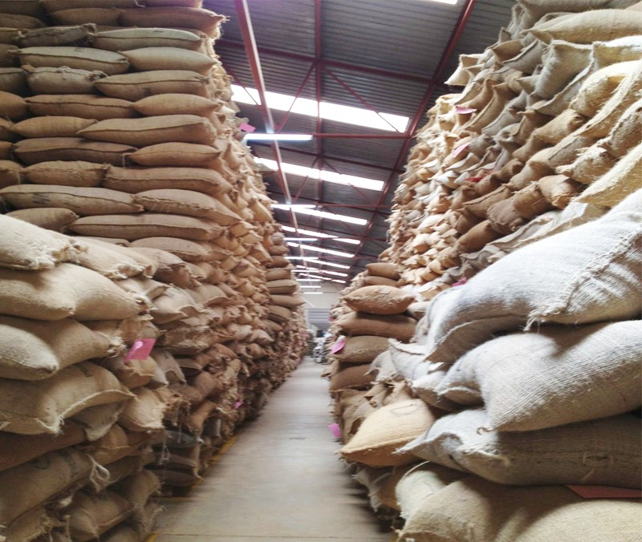
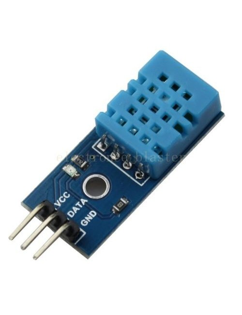
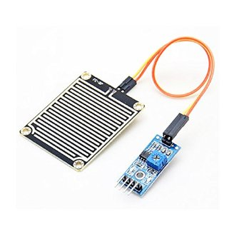
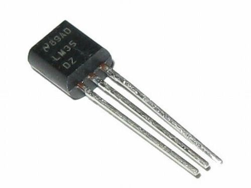
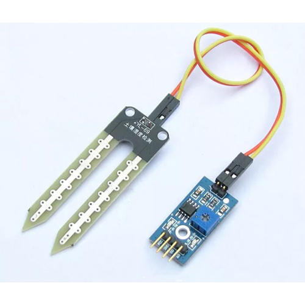
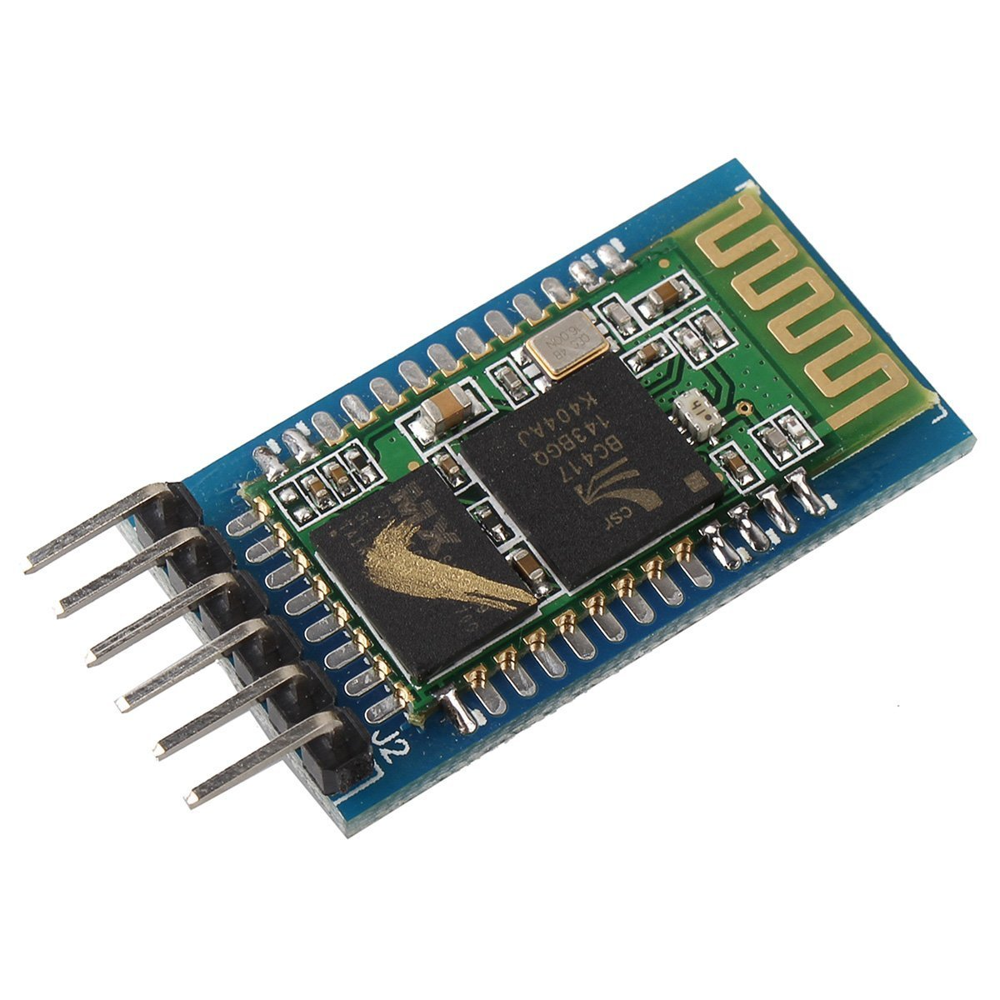
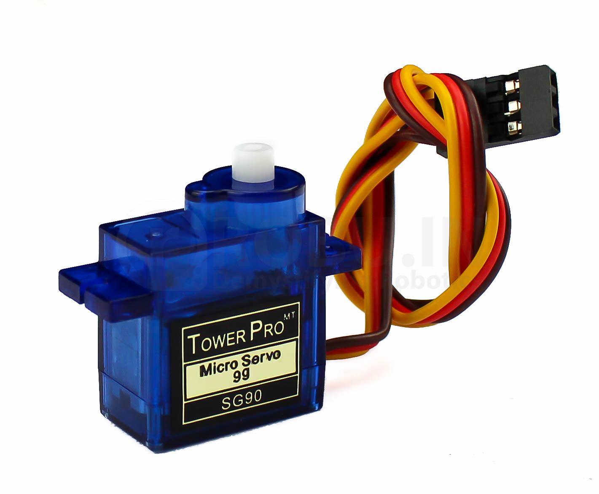

# Automated Food Grain Protection

Developing solutions for village farmers to protect their grains.

## Introduction

Agriculture plays a vital role in increasing any nation's economy. India being an agriculture country; where 50% population depends on farming, **storage and protection** of grains plays a crucial role in developing nation's economy. In the process of grain storage, temperature and humidity are major environmental factors that can influence directly on the quality of the Grain. Hence, there is a necessity to monitor the vital parameters continuously during storage and communicate the status to the manager in real time which becomes challenging.The traditional methods require continuous human efforts which is practically not feasible. There is a need for smart grain management system with automation which can monitor environmental parameters such as **temperature, humidity and rain** and give status updates and warnings to the manager.

## Grain protection system description

On the whole, the protection system mainly consists of *a microprocessor(ARDUINO UNO), a communication module(Bluetooth module),various types of sensors(rain, humidity, temperature and moisture) and protection mechanism*. The microprocessor is linked with **Bluetooth module** for sending status updates to the manager. The manager will receive updates from the Bluetooth module through a mobile application. There are future plans to extend the communication range by replacing the Bluetooth module with a GSM module. The manager can set the limits of environmental parameters manually to get warnings on the mobile application. The sensors are directly connected to ARDUINO board through jumper wires. The protection mechanism consists of two servo motors.

Working mechanism of the system Data of various parameters; namely temperature, humidity and rainfall, will be collected chiefly by the sensors. 

## Components:

### Micro Controller(Arduino Uno R3):

We are using Arduino Uno R3 to process and send data using bluetooth module. The Arduino Uno is a microcontroller board based on the ATmega328. It has 14 digital input/output pins of which 6 can be used as PWM outputs, 6 analog inputs, a 16 MHz ceramic resonator, a USB connection, a power jack, an ICSP header, and a reset button. 

### Humidity Sensor:

As we know the quality and health of the crops is greatly affected by the amount the amount of the water content in the air called the humidity. Humidity directly affects the health of the crops, more humidity in the air can lead to more absorption of water by the grains hence, degrading the quality of the crops. Thus it becomes a matter of fact to control the humidity present in the air in the location where the grains are stored. To counter the damages done by high humidity to the crops we can install a humidity sensor. The DHT11 sensor comes in a single row 4-pin package and operates from 3.5 to 5.5V power supply. It measures the relative humidity ranging from 20-95% with an accuracy of 5%.

### Rain Sensor: 

The working of rain sensor is based on electrical conductivity of water. Raindrop sensor is basically a board on which nickel is coated in the form of lines. When there is no rain drop on board, resistance is high. In the presence of rain drop, the parallel lines of coated nickel gets connected through rain drop as a conducting medium. Thus, the resistance gets reduced and there is corresponding drop in voltage which can be used to detect rain drop. Presence of water in sacks of grain can prove to be harmful as it can induce the growth of bugs and pesticides. The sensor can be used to detect rain in case the grains are kept in an open storage, or it can be used to detect presence of water leakages in closed grain storage facility.

### Temperature Sensor:

The most influential factors in the storage of grains is humidity and temperature. The best temperature for storage is between 40 – 60 degrees. Higher temperature will affect the ability of the stored seeds to germinate over time, but food value is only slightly reduced.  Freezing temperatures will not damage stored grains or pulses.
We are using LM-35 temperature sensor which measures temperature with an electrical o/p comparative to the temperature (in °C). It produces an output voltage that is proportional to the Celsius temperature. The scale factor is 0.01V/°C.
The LM35 does not need any exterior calibration and maintains an exactness of +/-0.4°C at room temperature and +/-0.8°C over a range of 0°C to +100°C.

### Moisture Sensor:

The soil moisture sensor consists of two probes which are used to measure the volumetric content of water. The two probes allow the current to pass through the soil and then it gets the resistance value to measure the moisture value. When there is more water, the soil will conduct more electricity which means that there will be less resistance. Therefore, the moisture level will be higher. Dry soil conducts electricity poorly, so when there will be less water, then the soil will conduct less electricity which means that there will be more resistance. Therefore, the moisture level will be lower.

### Bluetooth Module:

We are using HC-05 module to communicate between Arduino and the manager of grains.HC‐05 module is an easy to use Bluetooth SPP (Serial Port Protocol) module, designed for transparent wireless serial connection setup. The serial port Bluetooth module is fully qualified Bluetooth V2.0+EDR (Enhanced Data Rate) 3Mbps Modulation with complete 2.4GHz radio transceiver and baseband. It uses CSR Bluecore 04‐External single chip Rluetooth system with CMOS technology and with AFH (Adaptive Frequency Hopping Feature).

### Servo Motors:

